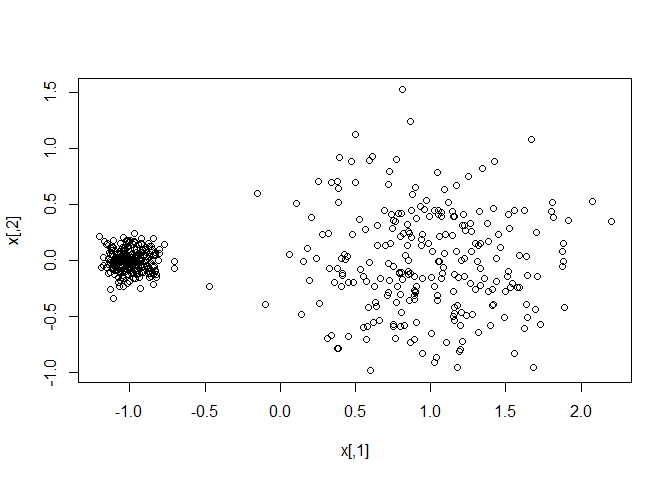

Hierarchical Clustering
================

> **Don't have to assume the number of clusters.**
> **Just draw "dendogram", and cut the tree at the proper level.**

> **Two main types** of hierarchical clustering :
> \* Agglemerative : All -&gt; merge the closest(similar) pair -&gt; one
> \* Divisive : One -&gt; split -&gt; all cluster containing one point

> We will focus on agglomerative clustering.

Agglomerative clustering
------------------------

### Algorithm

1 .Start with every point in its own cluster
2. Compute proximities(a proximity matrix *D(i,j)*) between clusters 3. Merge the two closest clusters 4. repeat 2 and 3 until only one cluster remains

How we measure similarity between two : distance
There are 4 major types to calculate the distance
1. single : The minimum distance
2. complete : The maximum distance
3. average : The average distance between all pairs of points
4. centroid : The distance between the centroids of each cluster

\*\* Now, we see the difference between them \*\*

``` r
library(mvtnorm)
library(ggplot2)
mu1 = c(-1, 0)
mu2 = c(1, 0)
sigma1 = diag(0.4^2, 2)
sigma2 = diag(0.4^2, 2)

x1 = rmvnorm(250, mu1, sigma1)
x2 = rmvnorm(250, mu2, sigma2)
x = rbind(x1, x2)
plot(x)
```


``` r
# Run hierarchical clustering with single (min) linkage
# here min produces counterintuitive results
x_dist = dist(x)
h1 = hclust(x_dist, method='single')
c1 = cutree(h1, 2)

D = data.frame(x, z = c1)
ggplot(D) + geom_point(aes(x=X1, y=X2, col=factor(z)))
```


``` r
# Run hierarchical clustering with complete (max) linkage
h2 = hclust(x_dist, method='complete')
c2 = cutree(h2, 2)
D2 = data.frame(x, z = c2)
ggplot(D2) + geom_point(aes(x=X1, y=X2, col=factor(z)))
```


``` r
# Run hierarchical clustering with average linkage
h3 = hclust(x_dist, method='average')
c3 = cutree(h3, 2)
D3 = data.frame(x, z = c3)
ggplot(D3) + geom_point(aes(x=X1, y=X2, col=factor(z)))
```


``` r
# But here's a different example where max produces counterintuitive results 
# => single method is better in this case
set.seed(84958)
mu1 = c(-1, 0)
mu2 = c(1, 0)
sigma1 = diag(0.1^2, 2)
sigma2 = diag(0.45^2, 2)

x1 = rmvnorm(250, mu1, sigma1)
x2 = rmvnorm(250, mu2, sigma2)
x = rbind(x1, x2)
plot(x)
```



``` r
# Run hierarchical clustering with single (min) linkage
x_dist = dist(x)
h1 = hclust(x_dist, method='single')
c1 = cutree(h1, 2)
D = data.frame(x, z = c1)
ggplot(D) + geom_point(aes(x=X1, y=X2, col=factor(z)))
```


``` r
# Run hierarchical clustering with complete (max) linkage
h2 = hclust(x_dist, method='complete')
c2 = cutree(h2, 2)
D2 = data.frame(x, z = c2)
ggplot(D2) + geom_point(aes(x=X1, y=X2, col=factor(z)))
```


``` r
# Run hierarchical clustering with average linkage
h3 = hclust(x_dist, method='average')
c3 = cutree(h3, 2)
D3 = data.frame(x, z = c3)
ggplot(D3) + geom_point(aes(x=X1, y=X2, col=factor(z)))
```


Example : Protein data
----------------------

### Data set

shows protein sources, such as redmeat, whitemeat, eggs, fish, according to Countries.

``` r
protein = read.csv("../data/protein.csv", row.names=1)
head(protein)
```

    ##                RedMeat WhiteMeat Eggs Milk Fish Cereals Starch Nuts Fr.Veg
    ## Albania           10.1       1.4  0.5  8.9  0.2    42.3    0.6  5.5    1.7
    ## Austria            8.9      14.0  4.3 19.9  2.1    28.0    3.6  1.3    4.3
    ## Belgium           13.5       9.3  4.1 17.5  4.5    26.6    5.7  2.1    4.0
    ## Bulgaria           7.8       6.0  1.6  8.3  1.2    56.7    1.1  3.7    4.2
    ## Czechoslovakia     9.7      11.4  2.8 12.5  2.0    34.3    5.0  1.1    4.0
    ## Denmark           10.6      10.8  3.7 25.0  9.9    21.9    4.8  0.7    2.4

### Hierarchical clustering example

-   normalize data set because each feature has a different unit.

``` r
# Center/scale the data
protein_scaled = scale(protein, center=TRUE, scale=TRUE) 
```

-   calculate the distance of each point

``` r
# Form a pairwise distance matrix using the dist function
protein_distance_matrix = dist(protein_scaled, method='euclidean')
```

-   run h-clustering : hclust fn(Method is the type of distance)

``` r
# Now run hierarchical clustering
hier_protein = hclust(protein_distance_matrix, method='average') 

# Plot the dendrogram
plot(hier_protein, cex=0.8)
```


-   clustering by using cutree

``` r
cluster1 = cutree(hier_protein, k=5) 
summary(factor(cluster1))
```

    ##  1  2  3  4  5 
    ##  5 15  2  2  1

``` r
which(cluster1 == 1)
```

    ##    Albania   Bulgaria    Hungary    Romania Yugoslavia 
    ##          1          4         11         18         25

``` r
which(cluster1 == 2)
```

    ##        Austria        Belgium Czechoslovakia        Denmark      E Germany 
    ##              2              3              5              6              7 
    ##        Finland         France        Ireland    Netherlands         Norway 
    ##              8              9             12             14             15 
    ##         Poland         Sweden    Switzerland             UK      W Germany 
    ##             16             20             21             22             24

``` r
which(cluster1 == 3)
```

    ## Greece  Italy 
    ##     10     13

-   cluster using max ("complete") linkage

``` r
# Using max ("complete") linkage instead
hier_protein2 = hclust(protein_distance_matrix, method='complete') 

# Plot the dendrogram
plot(hier_protein2, cex=0.8)
```


``` r
cluster2 = cutree(hier_protein2, k=5)
summary(factor(cluster2))
```

    ## 1 2 3 4 5 
    ## 6 8 5 4 2

``` r
# Examine the cluster members
which(cluster2 == 1)
```

    ##    Albania   Bulgaria     Greece      Italy    Romania Yugoslavia 
    ##          1          4         10         13         18         25

``` r
which(cluster2 == 2)
```

    ##     Austria     Belgium      France     Ireland Netherlands Switzerland 
    ##           2           3           9          12          14          21 
    ##          UK   W Germany 
    ##          22          24

``` r
which(cluster2 == 3)
```

    ## Czechoslovakia      E Germany        Hungary         Poland           USSR 
    ##              5              7             11             16             23

Example : car data
------------------

### Data set

shows cars' type, price and specifications(engine, cylinder, horsepower, MPG, weight, size)

``` r
cars = read.csv('../data/cars.csv', header=TRUE)
str(cars)
```

    ## 'data.frame':    387 obs. of  18 variables:
    ##  $ Sports    : int  0 0 0 1 0 0 0 0 0 0 ...
    ##  $ SUV       : int  0 0 1 0 0 0 0 0 0 0 ...
    ##  $ Wagon     : int  0 0 0 0 0 0 0 0 0 0 ...
    ##  $ Minivan   : int  0 0 0 0 0 0 0 0 0 0 ...
    ##  $ Pickup    : int  0 0 0 0 0 0 0 0 0 0 ...
    ##  $ AWD       : int  0 0 1 0 0 0 0 0 0 0 ...
    ##  $ RWD       : int  0 0 0 1 0 0 0 0 0 0 ...
    ##  $ Retail    : int  43755 46100 36945 89765 23820 33195 26990 25940 35940 42490 ...
    ##  $ Dealer    : int  39014 41100 33337 79978 21761 30299 24647 23508 32506 38325 ...
    ##  $ Engine    : num  3.5 3.5 3.5 3.2 2 3.2 2.4 1.8 1.8 3 ...
    ##  $ Cylinders : int  6 6 6 6 4 6 4 4 4 6 ...
    ##  $ Horsepower: int  225 225 265 290 200 270 200 170 170 220 ...
    ##  $ CityMPG   : int  18 18 17 17 24 20 22 22 23 20 ...
    ##  $ HighwayMPG: int  24 24 23 24 31 28 29 31 30 27 ...
    ##  $ Weight    : int  3880 3893 4451 3153 2778 3575 3230 3252 3638 3814 ...
    ##  $ Wheelbase : int  115 115 106 100 101 108 105 104 105 105 ...
    ##  $ Length    : int  197 197 189 174 172 186 183 179 180 180 ...
    ##  $ Width     : int  72 72 77 71 68 72 69 70 70 70 ...

### Hierarchical clustering example

-   For clustering data, we use only specification features. And do the same procedure as the above data set.

``` r
# Center and scale the data
X = cars[,-(1:9)]
X = scale(X, center=TRUE, scale=TRUE)

# First form a pairwise distance matrix
distance_between_cars = dist(X)

# Now run hierarchical clustering
h1 = hclust(distance_between_cars, method='complete')

# Plot the dendrogram
plot(h1, cex=0.3)
```


-   show the result of 10 clusters

``` r
# Cut the tree into 10 clusters
cluster1 = cutree(h1, k=10)
summary(factor(cluster1))
```

    ##   1   2   3   4   5   6   7   8   9  10 
    ## 110  92  57  57   3  13  48   3   2   2

``` r
# Examine the cluster members
which(cluster1 == 1)
```

    ##                               Acura 3.5 RL 
    ##                                          1 
    ##                    Acura 3.5 RL Navigation 
    ##                                          2 
    ##                                   Acura TL 
    ##                                          6 
    ##                    Audi A4 3.0 convertible 
    ##                                         10 
    ##                 Audi A4 3.0 Quattro manual 
    ##                                         12 
    ##                   Audi A4 3.0 Quattro auto 
    ##                                         13 
    ##            Audi A4 3.0 Quattro convertible 
    ##                                         14 
    ##        Audi A6 2.7 Turbo Quattro four-door 
    ##                                         15 
    ##                                Audi A6 3.0 
    ##                                         16 
    ##                  Audi A6 3.0 Avant Quattro 
    ##                                         17 
    ##                        Audi A6 3.0 Quattro 
    ##                                         18 
    ##                         BMW 525i four-door 
    ##                                         36 
    ##                         BMW 530i four-door 
    ##                                         37 
    ##                                BMW X3 3.0i 
    ##                                         43 
    ##                       Buick Century Custom 
    ##                                         47 
    ##             Buick LeSabre Custom four-door 
    ##                                         48 
    ##                      Buick LeSabre Limited 
    ##                                         49 
    ##                          Buick Park Avenue 
    ##                                         50 
    ##                    Buick Park Avenue Ultra 
    ##                                         51 
    ##                             Buick Regal GS 
    ##                                         53 
    ##                             Buick Regal LS 
    ##                                         54 
    ##                        Buick Rendezvous CX 
    ##                                         55 
    ##                           Cadillac CTS VVT 
    ##                                         56 
    ##                           Chevrolet Impala 
    ##                                         71 
    ##                        Chevrolet Impala LS 
    ##                                         72 
    ##                        Chevrolet Impala SS 
    ##                                         73 
    ##                        Chevrolet Malibu LS 
    ##                                         75 
    ##                        Chevrolet Malibu LT 
    ##                                         76 
    ##                      Chevrolet Malibu Maxx 
    ##                                         77 
    ##                   Chevrolet Monte Carlo LS 
    ##                                         78 
    ##                   Chevrolet Monte Carlo SS 
    ##                                         79 
    ##                       Chevrolet Venture LS 
    ##                                         84 
    ##                              Chrysler 300M 
    ##                                         85 
    ##              Chrysler 300M Special Edition 
    ##                                         86 
    ##                       Chrysler Concorde LX 
    ##                                         87 
    ##                      Chrysler Concorde LXi 
    ##                                         88 
    ##                   Chrysler Sebring Touring 
    ##                                         95 
    ##       Chrysler Sebring Limited convertible 
    ##                                         97 
    ##                           Dodge Caravan SE 
    ##                                        100 
    ##                          Dodge Intrepid ES 
    ##                                        103 
    ##                          Dodge Intrepid SE 
    ##                                        104 
    ##                               Ford Mustang 
    ##                                        122 
    ##                             Ford Taurus LX 
    ##                                        124 
    ##                             Ford Taurus SE 
    ##                                        125 
    ##                    Ford Taurus SES Duratec 
    ##                                        126 
    ##                         Honda Accord EX V6 
    ##                                        133 
    ##                         Honda Accord LX V6 
    ##                                        135 
    ##                       Hyundai Santa Fe GLS 
    ##                                        156 
    ##                         Hyundai Sonata GLS 
    ##                                        157 
    ##                          Hyundai Sonata LX 
    ##                                        158 
    ##                              Hyundai XG350 
    ##                                        160 
    ##                            Hyundai XG350 L 
    ##                                        161 
    ##                               Infiniti G35 
    ##                                        164 
    ##                   Infiniti G35 Sport Coupe 
    ##                                        165 
    ##                           Infiniti G35 AWD 
    ##                                        166 
    ##                               Infiniti I35 
    ##                                        167 
    ##                          Jaguar S-Type 3.0 
    ##                                        172 
    ##                          Jaguar X-Type 2.5 
    ##                                        176 
    ##                          Jaguar X-Type 3.0 
    ##                                        177 
    ##                           Kia Optima LX V6 
    ##                                        188 
    ##                               Lexus ES 330 
    ##                                        200 
    ##                               Lexus GS 300 
    ##                                        201 
    ##                               Lexus RX 330 
    ##                                        210 
    ##                       Lincoln LS V6 Luxury 
    ##                                        212 
    ##                      Lincoln LS V6 Premium 
    ##                                        213 
    ##                               Mazda MPV ES 
    ##                                        221 
    ##                       Mercedes-Benz CLK320 
    ##                                        235 
    ##                         Mercedes-Benz E320 
    ##                                        237 
    ##               Mercedes-Benz E320 four-door 
    ##                                        238 
    ##                           Mercury Sable GS 
    ##                                        256 
    ##                 Mercury Sable GS four-door 
    ##                                        257 
    ##                   Mercury Sable LS Premium 
    ##                                        258 
    ##                     Mitsubishi Diamante LS 
    ##                                        261 
    ##                          Mitsubishi Galant 
    ##                                        265 
    ##                           Nissan Altima SE 
    ##                                        272 
    ##                           Nissan Maxima SE 
    ##                                        273 
    ##                           Nissan Maxima SL 
    ##                                        274 
    ##                              Nissan Murano 
    ##                                        275 
    ##                       Oldsmobile Alero GLS 
    ##                                        284 
    ##                   Oldsmobile Silhouette GL 
    ##                                        286 
    ##                             Pontiac Aztekt 
    ##                                        287 
    ##                        Pontiac Grand Am GT 
    ##                                        289 
    ##                     Pontiac Grand Prix GT1 
    ##                                        290 
    ##                     Pontiac Grand Prix GT2 
    ##                                        291 
    ##                            Pontiac Montana 
    ##                                        292 
    ##                        Pontiac Montana EWB 
    ##                                        293 
    ##                               Saab 9-5 Arc 
    ##                                        307 
    ##                              Saab 9-5 Aero 
    ##                                        308 
    ##                    Saab 9-5 Aero four-door 
    ##                                        309 
    ##                              Saturn L300-2 
    ##                                        316 
    ##                          Subaru Outback H6 
    ##                                        328 
    ##                     Subaru Outback H-6 VDC 
    ##                                        329 
    ##                           Suzuki Verona LX 
    ##                                        335 
    ##                             Suzuki XL-7 EX 
    ##                                        337 
    ##                           Toyota Avalon XL 
    ##                                        339 
    ##                          Toyota Avalon XLS 
    ##                                        340 
    ##                         Toyota Camry LE V6 
    ##                                        342 
    ##                        Toyota Camry XLE V6 
    ##                                        343 
    ##                  Toyota Camry Solara SE V6 
    ##                                        345 
    ##        Toyota Camry Solara SLE V6 two-door 
    ##                                        346 
    ##                       Toyota Highlander V6 
    ##                                        354 
    ## Volkswagen Passat GLX V6 4MOTION four-door 
    ##                                        372 
    ##                              Volvo C70 LPT 
    ##                                        376 
    ##                              Volvo C70 HPT 
    ##                                        377 
    ##                              Volvo S60 2.5 
    ##                                        379 
    ##                               Volvo S60 T5 
    ##                                        380 
    ##                             Volvo S80 2.5T 
    ##                                        382 
    ##                              Volvo S80 2.9 
    ##                                        383 
    ##                               Volvo S80 T6 
    ##                                        384 
    ##                                 Volvo XC70 
    ##                                        386
