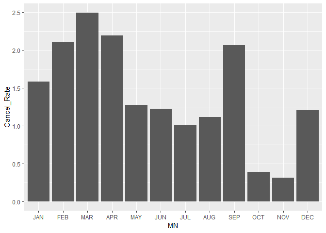
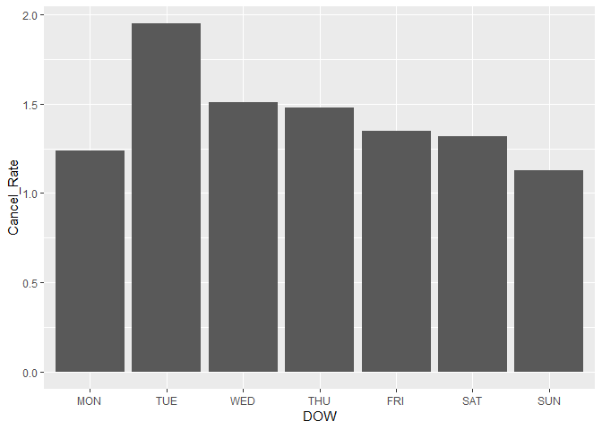
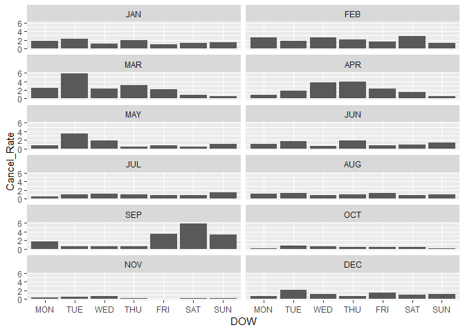
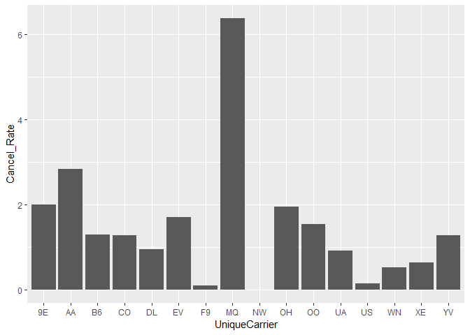
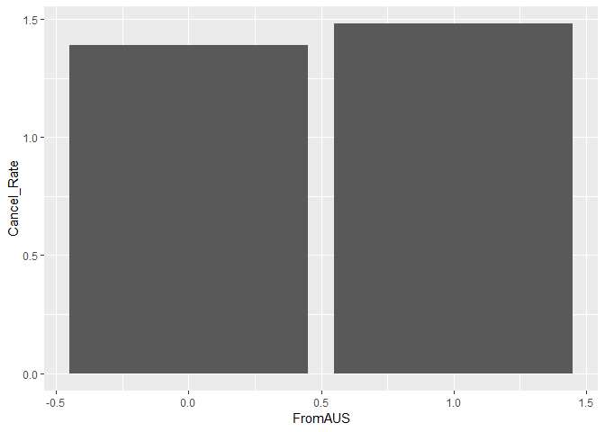
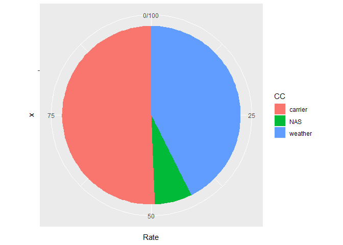
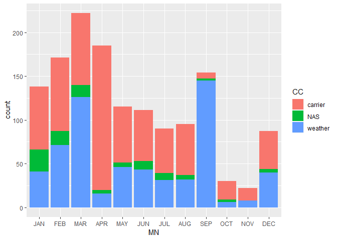
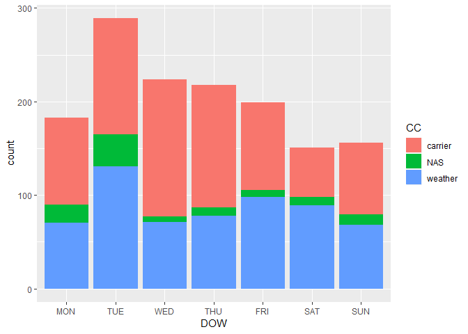
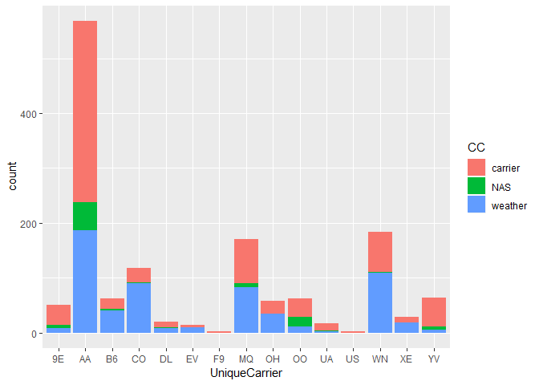

flights at ABIA
================

Introduction
------------

The flight data of ABIA contains 99,260 itineraris from or to Austin. There are delayed, canceled, or diverted data. For this analysis, I would like to focus on the cancellation, because the worst option for itinerary must be a cancellation.

``` r
# loading packages
library(tidyverse)
library(knitr)
```

``` r
# import dataset 
ABIA = read.csv("../../data/ABIA.csv")
head(ABIA)
```

    ##   Year Month DayofMonth DayOfWeek DepTime CRSDepTime ArrTime CRSArrTime
    ## 1 2008     1          1         2     120       1935     309       2130
    ## 2 2008     1          1         2     555        600     826        835
    ## 3 2008     1          1         2     600        600     728        729
    ## 4 2008     1          1         2     601        605     727        750
    ## 5 2008     1          1         2     601        600     654        700
    ## 6 2008     1          1         2     636        645     934        932
    ##   UniqueCarrier FlightNum TailNum ActualElapsedTime CRSElapsedTime AirTime
    ## 1            9E      5746  84129E               109            115      88
    ## 2            AA      1614  N438AA               151            155     133
    ## 3            YV      2883  N922FJ               148            149     125
    ## 4            9E      5743  89189E                86            105      70
    ## 5            AA      1157  N4XAAA                53             60      38
    ## 6            NW      1674   N967N               178            167     145
    ##   ArrDelay DepDelay Origin Dest Distance TaxiIn TaxiOut Cancelled
    ## 1      339      345    MEM  AUS      559      3      18         0
    ## 2       -9       -5    AUS  ORD      978      7      11         0
    ## 3       -1        0    AUS  PHX      872      7      16         0
    ## 4      -23       -4    AUS  MEM      559      4      12         0
    ## 5       -6        1    AUS  DFW      190      5      10         0
    ## 6        2       -9    AUS  MSP     1042     11      22         0
    ##   CancellationCode Diverted CarrierDelay WeatherDelay NASDelay
    ## 1                         0          339            0        0
    ## 2                         0           NA           NA       NA
    ## 3                         0           NA           NA       NA
    ## 4                         0           NA           NA       NA
    ## 5                         0           NA           NA       NA
    ## 6                         0           NA           NA       NA
    ##   SecurityDelay LateAircraftDelay
    ## 1             0                 0
    ## 2            NA                NA
    ## 3            NA                NA
    ## 4            NA                NA
    ## 5            NA                NA
    ## 6            NA                NA

Dress data up
-------------

I started by dressing data up for better visualization or analysis. For example, I changed Month, day data from numeric to factor and cancellation code. And I made new data frame for checking the departure from or arrival in Austin.

``` r
ABIA$DOW = cut(ABIA$DayOfWeek, breaks=7, labels=c("MON", "TUE", "WED", "THU", "FRI", "SAT", "SUN"))
ABIA$MN = cut(ABIA$Month, breaks=12, labels=c("JAN", "FEB", "MAR", "APR", "MAY", "JUN", "JUL", "AUG", "SEP", "OCT", "NOV", "DEC"))
ABIA[ABIA$CancellationCode=='A', 'CC']="carrier"
ABIA[ABIA$CancellationCode=='B', 'CC']="weather"
ABIA[ABIA$CancellationCode=='C', 'CC']="NAS"
ABIA[ABIA$Origin=='AUS', 'FromAUS']=1
ABIA[ABIA$Dest=='AUS', 'FromAUS']=0
```

Review cancellation rate
------------------------

The important informaiton about cancellation is not the number of cancellation but the rate of cancellation. I calculated the rate by dividing cancelled flights by all flights for each case.

### Cancellation rate w.r.t. Month and Day

First, we can see the cancellation rate by Month.It tends to be high in March, April.

``` r
ABIA_Cc_M = ABIA %>%
  group_by(MN) %>%
  summarize(Cancel_Rate=round(sum(Cancelled==1)/n()*100,digits=2))
ggplot() + geom_col(data=ABIA_Cc_M, aes(x=MN, y=Cancel_Rate))
```



``` r
kable(ABIA_Cc_M, caption="Cancellation Rate by Month")
```

| MN  |  Cancel\_Rate|
|:----|-------------:|
| JAN |          1.58|
| FEB |          2.10|
| MAR |          2.49|
| APR |          2.19|
| MAY |          1.27|
| JUN |          1.22|
| JUL |          1.01|
| AUG |          1.11|
| SEP |          2.06|
| OCT |          0.39|
| NOV |          0.31|
| DEC |          1.20|

Second, the cancellation rate by Day. It tends to be high on Tuesday.

``` r
ABIA_Cc_D = ABIA %>%
  group_by(DOW) %>%
  summarize(Cancel_Rate=round(sum(Cancelled==1)/n()*100,digits=2))
ggplot() + geom_col(data=ABIA_Cc_D, aes(x=DOW, y=Cancel_Rate))
```



``` r
kable(ABIA_Cc_D, caption="Cancellation Rate by Day")
```

| DOW |  Cancel\_Rate|
|:----|-------------:|
| MON |          1.24|
| TUE |          1.95|
| WED |          1.51|
| THU |          1.48|
| FRI |          1.35|
| SAT |          1.32|
| SUN |          1.13|

Third, the cancellation rate by Day and Month. We need to be careful to check the flight plan on weekend in September.

``` r
ABIA_Cc = ABIA %>%
  group_by(DOW, MN) %>%
  summarize(Cancel_Rate=round(sum(Cancelled==1)/n()*100,digits=2))
ggplot() + geom_col(data=ABIA_Cc, aes(x=DOW, y=Cancel_Rate)) + facet_wrap(~MN, nrow=6)
```



``` r
ABIA_Cc=xtabs(Cancel_Rate ~ DOW + MN, data=ABIA_Cc)
kable(ABIA_Cc, caption="Cancellation Rate by Month and Day")
```

|     |   JAN|   FEB|   MAR|   APR|   MAY|   JUN|   JUL|   AUG|   SEP|   OCT|   NOV|   DEC|
|-----|-----:|-----:|-----:|-----:|-----:|-----:|-----:|-----:|-----:|-----:|-----:|-----:|
| MON |  1.85|  2.52|  2.50|  0.85|  0.75|  1.15|  0.50|  1.21|  1.67|  0.10|  0.40|  0.72|
| TUE |  2.22|  1.79|  5.85|  1.88|  3.52|  1.69|  1.06|  1.39|  0.55|  0.79|  0.51|  2.03|
| WED |  1.16|  2.56|  2.40|  3.75|  1.96|  0.64|  1.22|  0.87|  0.58|  0.55|  0.70|  1.14|
| THU |  2.01|  2.11|  3.20|  3.89|  0.52|  1.83|  1.00|  1.03|  0.57|  0.38|  0.22|  0.74|
| FRI |  0.92|  1.68|  2.21|  2.36|  0.85|  0.79|  0.81|  1.36|  3.44|  0.38|  0.00|  1.51|
| SAT |  1.24|  2.91|  0.88|  1.46|  0.50|  0.97|  0.89|  0.85|  5.89|  0.40|  0.20|  0.91|
| SUN |  1.46|  1.37|  0.63|  0.54|  1.15|  1.41|  1.50|  1.02|  3.26|  0.10|  0.17|  1.21|

### Cancellation rate w.r.t. carrier

The worst carrier for its flight cancellation is MQ. However, the number of cancellation is the highest in AA, We will see it later.

``` r
ABIA_Cc_C = ABIA %>%
  group_by(UniqueCarrier) %>%
  summarize(Cancel_Rate=round(sum(Cancelled==1)/n()*100,digits=2))
ggplot() + geom_col(data=ABIA_Cc_C, aes(x=UniqueCarrier, y=Cancel_Rate))
```



``` r
kable(ABIA_Cc_C, caption="Cancellation Rate by Carrier")
```

| UniqueCarrier |  Cancel\_Rate|
|:--------------|-------------:|
| 9E            |          2.00|
| AA            |          2.84|
| B6            |          1.29|
| CO            |          1.28|
| DL            |          0.94|
| EV            |          1.70|
| F9            |          0.09|
| MQ            |          6.38|
| NW            |          0.00|
| OH            |          1.94|
| OO            |          1.54|
| UA            |          0.91|
| US            |          0.14|
| WN            |          0.52|
| XE            |          0.63|
| YV            |          1.28|

### Cancellation rate between departure and arrival

There is no big difference in cancellation rate between departure and arrival.

``` r
ABIA_Cc_A = ABIA %>%
  group_by(FromAUS) %>%
  summarize(Cancel_Rate=round(sum(Cancelled==1)/n()*100,digits=2))
ggplot() + geom_col(data=ABIA_Cc_A, aes(x=FromAUS, y=Cancel_Rate))
```



``` r
kable(ABIA_Cc_A, caption="Cancellation Rate for departure and arrival")
```

|  FromAUS|  Cancel\_Rate|
|--------:|-------------:|
|        0|          1.39|
|        1|          1.48|

Cancellation Reason
-------------------

The main reasons of cancellation at Austin Airport came from carrier and weather.

``` r
ABIA_CC = ABIA %>%
  filter(Cancelled==1) %>%
  group_by(CC) %>%
  summarize(Number=n(),Rate=round(n()/length(which(ABIA$Cancelled==1))*100, digits=2))
ggplot() + 
  geom_bar(data=ABIA_CC, aes(x="", y=Rate, fill=CC), width=1, stat="identity") +
  coord_polar("y", start=0)
```



``` r
kable(ABIA_CC, caption="Cancellation Reason")
```

| CC      |  Number|   Rate|
|:--------|-------:|------:|
| carrier |     719|  50.63|
| NAS     |      96|   6.76|
| weather |     605|  42.61|

-   (By Month) Flights cancelled by weather mostly in March and September. As expected, winter weather is not the main reason of cancellation because it is not cold in Austin. Interesting figure is that there were many cancellations by carrier in April.

``` r
ABIA_C = subset(ABIA, Cancelled==1)
ggplot() + geom_bar(data=ABIA_C, aes(x=MN, fill=CC))
```



-   (By Day) There is no special pattern in cancellation reason and day of week. One thing is that there were many cancellation by NAS on Monday and Tuesday.

``` r
ggplot() + geom_bar(data=ABIA_C, aes(x=DOW, fill=CC))
```



-   (By Carrier) As I mentioned, the number of cancellation of AA is the biggest. However, it might mainly come from its frequent flight, becasue AA's cancellation rate was not high. The thing in this picture is the rate. 9E, YV and OO tend to cancel their flight because of their own problem.

``` r
ggplot() + geom_bar(data=ABIA_C, aes(x=UniqueCarrier, fill=CC))
```



Conclusion
----------

If you want to secure your flight, then you had better avoid Tuesday if it is March, Wednesday and Thursday in April, weekends in November. Moreover, you had better avoid MQ, because its rate is extremly high, and YV, 9E, and OO, because their main cancellation reason are themselves. This is not a sophisticated analysis, just shows rough trend.
