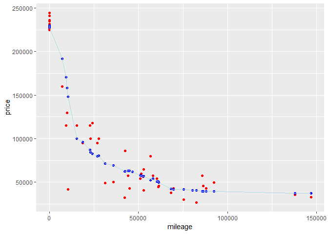

S-Class : Regression vs KNN
================

Introduction
------------

There are 29,366 data regarding pre-owned S-Class vehicles' price. We will focus on three properties, which are *trim*, *mileage*, *price*, in this analysis. I cut other properties from the original data, and made subsets for S-class 305 and S-class 65 AMG.

``` r
# loading packages
library(tidyverse)
library(FNN)
```

``` r
# import dataset 
sclass = read.csv("../../data/sclass.csv")
head(sclass)
```

    ##   id trim subTrim condition isOneOwner mileage year  color displacement
    ## 1  2  320    unsp      Used          f  129948 1995   Gold        3.2 L
    ## 2  4  320    unsp      Used          f  140428 1997  White        3.2 L
    ## 3  7  420    unsp      Used          f  113622 1999 Silver        4.2 L
    ## 4  8  420    unsp      Used          f  167673 1999 Silver        4.2 L
    ## 5 11  500    unsp      Used          f   63457 1997 Silver        5.0 L
    ## 6 13  430    unsp      Used          f   82419 2002  White        4.3 L
    ##       fuel state region soundSystem wheelType wheelSize featureCount price
    ## 1 Gasoline    PA    Mid     Premium     Alloy      unsp           26  6595
    ## 2 Gasoline    NY    Mid        Bose     Alloy      unsp           22  7993
    ## 3 Gasoline    NJ    Mid        unsp     Alloy      unsp           24  5995
    ## 4 Gasoline    GA    SoA        unsp     Alloy      unsp           24  3000
    ## 5 Gasoline    CO    Mtn      Alpine     Alloy        20           23 14975
    ## 6 Gasoline    NJ    Mid        Bose     Alloy        16           35  7400

``` r
# transform data frame
scl = select(sclass, trim, mileage, price)
scl_350 = subset(scl, trim=="350")
scl_65AMG = subset(scl, trim=="65 AMG")
```

Review
------

Overall, there is negative correlation between mileage and price. 65AMG vehicles are more expensive than 350.

``` r
# plot
ggplot() +
  geom_point(data=scl_350, aes(mileage, price), color="red") +
  geom_point(data=scl_65AMG, aes(mileage, price), color="blue") +
  labs(title="mileage vs price", caption="red: S Class 350  blue: S Class 65 AMG")
```


Prepare for KNN
---------------

Before running K-nearest-neighors, split data into training and testing. Prepare a function for calculating RMSE(root-mean squared error).

``` r
# make a train-test split
N350 = nrow(scl_350)
N350_train = floor(0.8*N350)
N350_test = N350-N350_train

N65M = nrow(scl_65AMG)
N65M_train = floor(0.8*N65M)
N65M_test = N65M-N65M_train

# slpit
train_ind_350 = sample.int(N350, N350_train, replace=F)
D350_train = scl_350[train_ind_350,]
D350_test = scl_350[-train_ind_350,]

train_ind_65M = sample.int(N65M, N65M_train, replace=F)
D65M_train = scl_65AMG[train_ind_65M,]
D65M_test = scl_65AMG[-train_ind_65M,]

# Arrange
D350_test = arrange(D350_test, mileage)
D65M_test = arrange(D65M_test, mileage)

# seperate X and Y
x350_train = select(D350_train, mileage)
y350_train = select(D350_train, price)
x350_test = select(D350_test, mileage)
y350_test = select(D350_test, price)

x65M_train = select(D65M_train, mileage)
y65M_train = select(D65M_train, price)
x65M_test = select(D65M_test, mileage)
y65M_test = select(D65M_test, price)

# rmse function
rmse = function(y, ypred) {
  sqrt(mean(data.matrix((y-ypred)^2)))
}
```

KNN for 350
-----------

### K=3, the least number

This prediction shows big fluctuation. RMSE is 8,087.50.

``` r
K = 3

knn350 = knn.reg(train = x350_train, test=x350_test, y=y350_train, k=K)

D350_test$ypred_knn350 = knn350$pred

ggplot(data = D350_test) +
  geom_point(mapping = aes(mileage, price), color='red') + 
  geom_point(aes(mileage, knn350$pred), color='blue')+ 
  geom_path(aes(mileage, knn350$pred), color='light blue')
```


``` r
rmse(y350_test, knn350$pred)
```

    ## [1] 11330.88

### K=20

This prediction still shows little fluctuation than K=3. RMSE is 7,389.42, might be the least one among these results.

``` r
### 
K = 20

knn350 = knn.reg(train = x350_train, test=x350_test, y=y350_train, k=K)
D350_test$ypred_knn350 = knn350$pred
ggplot(data = D350_test) +
  geom_point(mapping = aes(mileage, price), color='red') + 
  geom_point(aes(mileage, knn350$pred), color='blue')+ 
  geom_path(aes(mileage, knn350$pred), color='light blue')
```


``` r
rmse(y350_test, knn350$pred)
```

    ## [1] 10374.84

### K=60

This prediction became more smooth. RMSE is 7,733.16.

``` r
### 
K = 60

knn350 = knn.reg(train = x350_train, test=x350_test, y=y350_train, k=K)
D350_test$ypred_knn350 = knn350$pred
ggplot(data = D350_test) +
  geom_point(mapping = aes(mileage, price), color='red') + 
  geom_point(aes(mileage, knn350$pred), color='blue')+ 
  geom_path(aes(mileage, knn350$pred), color='light blue')
```


``` r
rmse(y350_test, knn350$pred)
```

    ## [1] 10975.42

### K=150

This prediction shows less fluctuation. First and last values show the same prediction value, so it seems to be a flat line. RMSE is 12,593.56.

``` r
### 
K = 150

knn350 = knn.reg(train = x350_train, test=x350_test, y=y350_train, k=K)
D350_test$ypred_knn350 = knn350$pred
ggplot(data = D350_test) +
  geom_point(mapping = aes(mileage, price), color='red') + 
  geom_point(aes(mileage, knn350$pred), color='blue')+ 
  geom_path(aes(mileage, knn350$pred), color='light blue')
```


``` r
rmse(y350_test, knn350$pred)
```

    ## [1] 14102.57

### K=332, maximum

When K=332, the maximum number, the same as the number of training data, the prediction shows flat line, it is average of price. RMSE is 23,105.49

``` r
### 
K = 332

knn350 = knn.reg(train = x350_train, test=x350_test, y=y350_train, k=K)
D350_test$ypred_knn350 = knn350$pred
ggplot(data = D350_test) +
  geom_point(mapping = aes(mileage, price), color='red') + 
  geom_point(aes(mileage, knn350$pred), color='blue')+ 
  geom_path(aes(mileage, knn350$pred), color='light blue')
```


``` r
rmse(y350_test, knn350$pred)
```

    ## [1] 23373.24

KNN for 65AMG
-------------

### K=3, the least number

This prediction shows big fluctuation. RMSE is 21,192.21.

``` r
###
K=3
knn65M = knn.reg(train = x65M_train, test=x65M_test, y=y65M_train, k=K)
D65M_test$ypred_knn65M = knn65M$pred

ggplot(data = D65M_test) +
  geom_point(mapping = aes(mileage, price), color='red') +
  geom_point(aes(mileage, knn65M$pred), color='blue') + 
  geom_path(aes(mileage, knn65M$pred), color='light blue')
```


``` r
rmse(y65M_test, knn65M$pred)
```

    ## [1] 20183.33

### K=10

This prediction still shows little fluctuation than K=3. RMSE is 21,391.12.

``` r
###
K=10
knn65M = knn.reg(train = x65M_train, test=x65M_test, y=y65M_train, k=K)
D65M_test$ypred_knn65M = knn65M$pred

ggplot(data = D65M_test) +
  geom_point(mapping = aes(mileage, price), color='red') +
  geom_point(aes(mileage, knn65M$pred), color='blue') + 
  geom_path(aes(mileage, knn65M$pred), color='light blue')
```


``` r
rmse(y65M_test, knn65M$pred)
```

    ## [1] 16866.85

### K=40

This prediction became more smooth. RMSE is 21,161.36, might be the least one among these results.

``` r
###
K=40
knn65M = knn.reg(train = x65M_train, test=x65M_test, y=y65M_train, k=K)
D65M_test$ypred_knn65M = knn65M$pred

ggplot(data = D65M_test) +
  geom_point(mapping = aes(mileage, price), color='red') +
  geom_point(aes(mileage, knn65M$pred), color='blue') + 
  geom_path(aes(mileage, knn65M$pred), color='light blue')
```



``` r
rmse(y65M_test, knn65M$pred)
```

    ## [1] 20419.55

### K=100

This prediction shows less fluctuation. First and last values show the same prediction value, so it seems to be a flat line. RMSE is 32,894.89.

``` r
###
K=100
knn65M = knn.reg(train = x65M_train, test=x65M_test, y=y65M_train, k=K)
D65M_test$ypred_knn65M = knn65M$pred

ggplot(data = D65M_test) +
  geom_point(mapping = aes(mileage, price), color='red') +
  geom_point(aes(mileage, knn65M$pred), color='blue') + 
  geom_path(aes(mileage, knn65M$pred), color='light blue')
```


``` r
rmse(y65M_test, knn65M$pred)
```

    ## [1] 34696.34

### K=233, maximum

When K=233, the maximum number, the same as the number of training data, the prediction shows flat line, it is average of price. RMSE is 80,531.07

``` r
### 

###
K=233
knn65M = knn.reg(train = x65M_train, test=x65M_test, y=y65M_train, k=K)
D65M_test$ypred_knn65M = knn65M$pred

ggplot(data = D65M_test) +
  geom_point(mapping = aes(mileage, price), color='red') +
  geom_point(aes(mileage, knn65M$pred), color='blue') + 
  geom_path(aes(mileage, knn65M$pred), color='light blue')
```


``` r
rmse(y65M_test, knn65M$pred)
```

    ## [1] 82291.24

Conclusion
----------

As we can see, the pitted values move smoothly as K increases, and the pitted line becomes a flat line that shows the average value. The optimal K which shows the minimum RMSE might be 20 for S 350, 40 for S 65AMG. This is because the price data for S 65 AMG has a high variation for its distribution.
