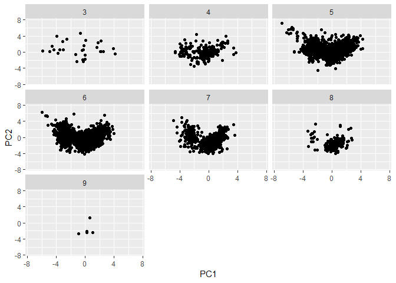

Wine Tasting(P\#1)
================

Introduction
------------

This is a prediction of type of wines, which are predicted by 11 chemical properties.

The data is the information on 11 chemical properties of 6497 diffrenct bottles of wine, and showing that whether it is red or white, and the quality of wines.

First, I find the **principal components**, next run **kmeans++ clustering**.

Before I start, modify data to run PCA and a clustering algorithm. Split the chemical properties, and **scale** them. Moreover, make classification data sets, which are white or red and the quality of wines.

``` r
X = wine[,-(12:13)]
X = scale(X, center =TRUE, scale = TRUE) ### center and scale the data

wine_RW = wine[,13]
wine_LV = wine[,12]
```

Classification by PCA
---------------------

I performed PCA on the scaled data set.
The result shows that the first 2 components can explain 50% of total variance.
The cumulative proportion of variance shows that PC1 ~ PC5 explains almost 80% of the variance in the data.

``` r
pcX = prcomp(X)
summary(pcX)
```

    ## Importance of components:
    ##                           PC1    PC2    PC3     PC4     PC5     PC6
    ## Standard deviation     1.7407 1.5792 1.2475 0.98517 0.84845 0.77930
    ## Proportion of Variance 0.2754 0.2267 0.1415 0.08823 0.06544 0.05521
    ## Cumulative Proportion  0.2754 0.5021 0.6436 0.73187 0.79732 0.85253
    ##                            PC7     PC8     PC9   PC10    PC11
    ## Standard deviation     0.72330 0.70817 0.58054 0.4772 0.18119
    ## Proportion of Variance 0.04756 0.04559 0.03064 0.0207 0.00298
    ## Cumulative Proportion  0.90009 0.94568 0.97632 0.9970 1.00000

I plot the data and loading vectors for the first 2 components, and check the loading vectors.
As we can see, PC1 explains positive "free.sulfur.dioxide", "total.sulfur.dioxide", and negative "volatile.acidity", "sulphates". PC2 explains positive "density", and negative "alcohol".

``` r
fviz_pca_biplot(pcX, geom.ind = "point")
```


``` r
pcX$rotation[,1:2]
```

    ##                              PC1         PC2
    ## fixed.acidity        -0.23879890  0.33635454
    ## volatile.acidity     -0.38075750  0.11754972
    ## citric.acid           0.15238844  0.18329940
    ## residual.sugar        0.34591993  0.32991418
    ## chlorides            -0.29011259  0.31525799
    ## free.sulfur.dioxide   0.43091401  0.07193260
    ## total.sulfur.dioxide  0.48741806  0.08726628
    ## density              -0.04493664  0.58403734
    ## pH                   -0.21868644 -0.15586900
    ## sulphates            -0.29413517  0.19171577
    ## alcohol              -0.10643712 -0.46505769

The graph with PC1 and PC2 seems to have two clusters. So, I draw a scatterplot of PC1 and PC2's scores by colors of wine.

``` r
scores = pcX$x
qplot(scores[,1], scores[,2], color = wine_RW, xlab='PC1', ylab='PC2',
      xlim=c(-7.5,7.5), ylim=c(-7.5,7.5))
```


As we can see, the first 2 components distinguish the reds from the whites mostly by PC1.
Suppose that the reds and the white are divided by the line "PC2 - 2 \* PC1 = 2",
then we can see 98.11 % is correct.

``` r
RW = ifelse(scores[,1] < -1, "red", "white")
table(RW, wine_RW)
```

    ##        wine_RW
    ## RW       red white
    ##   red   1545    99
    ##   white   54  4799

Next, I try to distinguish the quality of wines by using PCA result. The quality of wines is judged on a 1-10 scale, but there are 7 types(3 to 9) of wines in this data set.

``` r
summary(factor(wine_LV))
```

    ##    3    4    5    6    7    8    9 
    ##   30  216 2138 2836 1079  193    5

I draw a scatterplot of PC1 and PC2's scores by qualites of wine.
It is too complicated to distinguish by colors, so I use facet grid. However, unfortunately I can not find any clues to distinguish the quality of wines on the graph.
I try PC3 and PC4 coordinates, no clue at all, neither.

``` r
qplot(scores[,1], scores[,2], color = wine_LV, xlab='PC1', ylab='PC2',
      xlim=c(-7.5,7.5), ylim=c(-7.5,7.5))
```


``` r
qplot(scores[,1], scores[,2], facets = ~ wine_LV, xlab='PC1', ylab='PC2',
      xlim=c(-7.5,7.5), ylim=c(-7.5,7.5))
```



``` r
qplot(scores[,3], scores[,4], facets = ~ wine_LV, xlab='PC3', ylab='PC4',
      xlim=c(-7.5,7.5), ylim=c(-7.5,7.5))
```


Classification by clustering
----------------------------

I use Kmeans++ to distinguish wines, because we already know how many clusters are there.
For the color of wines, I divide the data set into 2 groups, while, for the qualities of wines, divide into 7 groups.

``` r
clstRW2 = kmeanspp(X, k=2, nstart=25)
clstLV2 = kmeanspp(X, k=7, nstart=25)
summary(factor(clstRW2$cluster))
```

    ##    1    2 
    ## 1643 4854

``` r
summary(factor(clstLV2$cluster))
```

    ##    1    2    3    4    5    6    7 
    ## 1041  929 1184 1195  639 1476   33

Plot the data with the coordinate system whose x-axis is "total.sulfur.dioxide" and y-axis is "sulphates".
This is because the biplot of PCA showed that both two axis explained the difference of the two groups.
The group 1 might be the red wines, and the group 2 might be the white wines.

``` r
qplot(total.sulfur.dioxide, sulphates, data=data.frame(X), color=factor(clstRW2$cluster))
```


When I use a fviz\_cluster function to show the plot with principle components coordinates, which looks better to distinguish the two groups.

``` r
fviz_cluster(clstRW2, data = X, ellipse.type = "convex", palette="jco", 
             ggtheme = theme_minimal())
```


we can see 98.58% is correct to distinguish the color of wines.

``` r
table(clstRW2$cluster, wine$color)
```

    ##    
    ##      red white
    ##   1 1575    68
    ##   2   24  4830

However, the clustering does not work for the quality of wines. The graph divided by 7 clusters doesn't clearly distinguish the groups.

``` r
fviz_cluster(clstLV2, data = X, 
             ellipse.type = "convex", palette="jco", ggtheme = theme_minimal())
```


``` r
table(clstLV2$cluster, wine$quality)
```

    ##    
    ##       3   4   5   6   7   8   9
    ##   1   2  29 298 503 179  30   0
    ##   2   7  61 470 347  42   2   0
    ##   3   4  21  80 528 451  96   4
    ##   4   5  64 414 538 144  30   0
    ##   5   4  15 200 266 140  14   0
    ##   6   7  24 656 645 122  21   1
    ##   7   1   2  20   9   1   0   0

The reason why we can not distinguish qualities
-----------------------------------------------

I think that there might be two reasons.
First, the quality of wines might be unrelated with 11 chemical properties.
Second, the target wines are mostly level 5 to 7. This uneven distributed data makes clustering difficult, even thouth there might be a relationship.

``` r
summary(factor(wine_LV))
```

    ##    3    4    5    6    7    8    9 
    ##   30  216 2138 2836 1079  193    5
