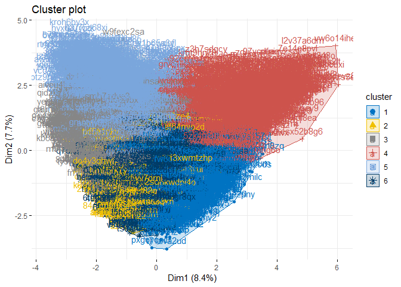

Market segmentation(P\#2)
================

Introduction
------------

This is an market segmentation analized by tweeter post.
The data set is 7,882 people's tweeter post, which are categorized by 36 keywords.
However, 4 keyword categories are not what we are interested in, which are 'chatter', 'uncategorized', 'spam', and 'adult'.
As a data preprocessing step, I delete the 4 uninterested keyword categories.

``` r
tweet = read.csv("../data/social_marketing.csv", header = TRUE, row.names=1)
tweet = tweet[,-c(1,5,35,36)]
```

I use Kmeans++ clustering to find some patterns for customer groups.
My strategy is that I run clustering and read the centroid of each cluster to find its own properties.
I didn't find out how to read the centeroid of each clusters with 'hclust' function. Thus, I just run Kmeans++ clustering.
There are 32 keywords to categorize customers' tweet. I tried PCA to compress the keyword categories, but the cumulative proportion of variance showed that PC1 to PC20 could explain 80% of whole variance. It might not be useful, I rather use the original features.

Before we start, make the data set normalized.

``` r
tweet_R = tweet / rowSums(tweet) # propotional values
tweet_Z = scale(tweet_R, center=TRUE, scale=TRUE) # normalize
```

Kmeans++ clustering
-------------------

### Find K

The important thing we should determine when we run Kmeans++ clustering is how many clusters we make.
I use gap-stat valuses to find the best K. The graph shows that 6 clusters might be optimal.

> fviz\_nbclust(tweet\_Z, kmeans, iter = 25, method="gap\_stat")


<p class="caption">
A caption
</p>

### clustering

I run kmeans++ with 6 clusters. Plot the result by using 'fviz\_cluser' function.
Howevner, the graph doesn't look well-distinguished clusters.

``` r
clustKM = kmeanspp(tweet_Z, k=6, nstart=25)
fviz_cluster(clustKM, data = tweet_Z, 
             ellipse.type = "convex", palette="jco", ggtheme = theme_minimal())
```



We can see some patterns in the clusters.
I look the centeroids of clusters. To see major factors, I see the firt 5 components.
Cluster 1 is the group who are interested in college(university), online games, photo sharing, sports playing and current events. They might be university male students. So, they are interested in online games, sports, and so on. Cluster 2 is the group who are intersted in politics, news, travel, automotive, and sports fandom. They might be male adults who care the politics, news, automotive and so on. Cluster 3 is the group who interested in health nutrition, personal fitness, cooking, outdoors. They care about health, and they are interested in cooking too. Cluster 4 might be religious and domestic father who also love sports. Cluster 5 might be young women who care fashion, beaty, and cureent events. Cluster 6 might be people who love shopping, tv and movie, travel and so on.

``` r
mu = attr(tweet_Z,"scaled:center")
sigma = attr(tweet_Z,"scaled:scale")

clst1 = clustKM$center[1,]*sigma + mu
sort(clst1, decreasing = TRUE) %>% head(5)
```

    ##      politics          news        travel    automotive sports_fandom 
    ##    0.15666004    0.11042931    0.09767655    0.05577308    0.04869572

``` r
clst2 = clustKM$center[2,]*sigma + mu
sort(clst2, decreasing = TRUE) %>% head(5)
```

    ##    college_uni  online_gaming  photo_sharing sports_playing current_events 
    ##     0.19989103     0.18289502     0.05675190     0.04989987     0.03954458

``` r
clst3 = clustKM$center[3,]*sigma + mu
sort(clst3, decreasing = TRUE) %>% head(5)
```

    ##        cooking  photo_sharing        fashion         beauty current_events 
    ##     0.19006877     0.10510200     0.10440306     0.07162564     0.04097536

``` r
clst4 = clustKM$center[4,]*sigma + mu
sort(clst4, decreasing = TRUE) %>% head(5)
```

    ## sports_fandom      religion          food     parenting        family 
    ##    0.11380388    0.09621115    0.08787631    0.07706824    0.05117795

``` r
clst5 = clustKM$center[5,]*sigma + mu
sort(clst5, decreasing = TRUE) %>% head(5)
```

    ## health_nutrition personal_fitness          cooking    photo_sharing 
    ##       0.22503461       0.12219578       0.06067708       0.05143919 
    ##         outdoors 
    ##       0.05135489

``` r
clst6 = clustKM$center[6,]*sigma + mu
sort(clst6, decreasing = TRUE) %>% head(5)
```

    ##  photo_sharing current_events       shopping        tv_film         travel 
    ##     0.13572086     0.08204641     0.08081110     0.05570561     0.05091450

I am not sure whether the clustering is clear and obvious.
However, the common major features seem to be reasonable. analysis
