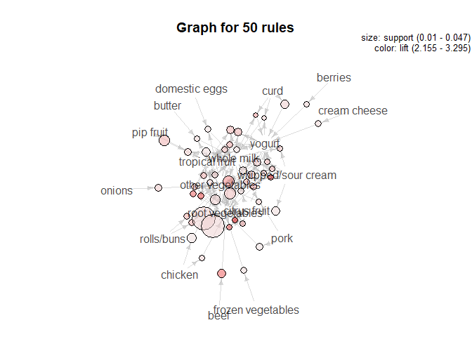

Grocery purchases(P\#3)
================

Introduction
------------

This is an association rule mining with groceries data.
The data is a list of shopping basket, which is divided by "," and "enter".
So, I split items in one's shopping basket for an association rule mining.

``` r
groc_raw = readLines("../data/groceries.txt")
head(groc_raw, 3)
```

    ## [1] "citrus fruit,semi-finished bread,margarine,ready soups"
    ## [2] "tropical fruit,yogurt,coffee"                          
    ## [3] "whole milk"

``` r
# transform for an association rule mining
groc = lapply(groc_raw,strsplit,split=",") # split by ','
groc = lapply(groc, unique) # delete repeated values
groc = lapply(groc, unlist) # list to vector
head(groc, 3)
```

    ## [[1]]
    ## [1] "citrus fruit"        "semi-finished bread" "margarine"          
    ## [4] "ready soups"        
    ## 
    ## [[2]]
    ## [1] "tropical fruit" "yogurt"         "coffee"        
    ## 
    ## [[3]]
    ## [1] "whole milk"

Association rule mining
-----------------------

Now, I run an association rule analysis by using 'arules' package.
First, I make a transaction table, and see what are the most frequent items.

``` r
# transaction table
groctrans = as(groc, "transactions") 
itemFrequencyPlot(groctrans, topN=20)
```


Next, make association rules, with minimum support 0.01, and minimum confidence 0.1, at least one item, and at most 10 items. There are **435** rules generated.

``` r
cart = apriori(groctrans, parameter=list(support=.01, confidence=.1, minlen=1, maxlen=10))
```

    ## Apriori
    ## 
    ## Parameter specification:
    ##  confidence minval smax arem  aval originalSupport maxtime support minlen
    ##         0.1    0.1    1 none FALSE            TRUE       5    0.01      1
    ##  maxlen target   ext
    ##      10  rules FALSE
    ## 
    ## Algorithmic control:
    ##  filter tree heap memopt load sort verbose
    ##     0.1 TRUE TRUE  FALSE TRUE    2    TRUE
    ## 
    ## Absolute minimum support count: 98 
    ## 
    ## set item appearances ...[0 item(s)] done [0.00s].
    ## set transactions ...[169 item(s), 9835 transaction(s)] done [0.00s].
    ## sorting and recoding items ... [88 item(s)] done [0.00s].
    ## creating transaction tree ... done [0.00s].
    ## checking subsets of size 1 2 3 4 done [0.00s].
    ## writing ... [435 rule(s)] done [0.00s].
    ## creating S4 object  ... done [0.00s].

Focus on some meaningful association rules. I extract association rules with confidence being 0.02 or higher. There are 232 rules with the condition.
Plot 50 association rules with highest lift valuses. One of strong red associations is from 'citrus fruit' to 'root vegetables'.

``` r
sub1 = subset(cart, subset = confidence > 0.2)
plot(head(sub1, 50, by='lift'), method='graph')
```



Here are 5 rules with the highest lift value.
People who buy 'citrus fruit' and 'other vegetables' tend to buy 'root vegetables'. They might be people who love fruits and vegetables.
People who buy 'beef' tend to buy 'root vegetables'. They might want to make garnish with root vegetables for their steak.

``` r
inspect(sort(sub1, by = "lift")[1:5]) 
```

    ##     lhs                   rhs                     support confidence     lift count
    ## [1] {citrus fruit,                                                                 
    ##      other vegetables} => {root vegetables}    0.01037112  0.3591549 3.295045   102
    ## [2] {other vegetables,                                                             
    ##      yogurt}           => {whipped/sour cream} 0.01016777  0.2341920 3.267062   100
    ## [3] {other vegetables,                                                             
    ##      tropical fruit}   => {root vegetables}    0.01230300  0.3427762 3.144780   121
    ## [4] {beef}             => {root vegetables}    0.01738688  0.3313953 3.040367   171
    ## [5] {citrus fruit,                                                                 
    ##      root vegetables}  => {other vegetables}   0.01037112  0.5862069 3.029608   102

People mostly buy 'whole milk'. Let's see what people who buy 'whole milk' tend to buy.
We can see people who buy 'curd' and 'whole milk' tend to buy 'yogurt', too. They might be dairy products loves.

``` r
submilk = subset(sub1, lhs %in% 'whole milk')
inspect(sort(submilk, by = "lift")[1:5])
```

    ##     lhs                              rhs               support   
    ## [1] {other vegetables,whole milk} => {root vegetables} 0.02318251
    ## [2] {curd,whole milk}             => {yogurt}          0.01006609
    ## [3] {tropical fruit,whole milk}   => {root vegetables} 0.01199797
    ## [4] {whole milk,yogurt}           => {tropical fruit}  0.01514997
    ## [5] {tropical fruit,whole milk}   => {yogurt}          0.01514997
    ##     confidence lift     count
    ## [1] 0.3097826  2.842082 228  
    ## [2] 0.3852140  2.761356  99  
    ## [3] 0.2836538  2.602365 118  
    ## [4] 0.2704174  2.577089 149  
    ## [5] 0.3581731  2.567516 149
